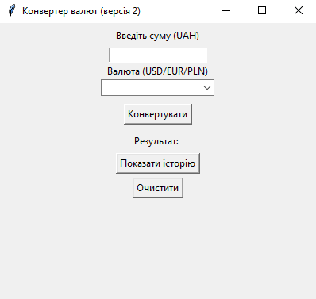
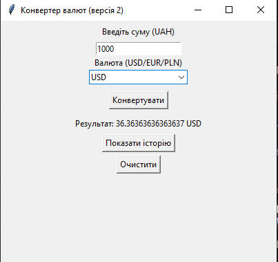

# Конвертер валют (Currency Converter)


Простий графічний застосунок для конвертації гривні (UAH) у долари США (USD), євро (EUR) та злоті (PLN). Розроблено на Python з використанням `tkinter`. 

## Скріншоти

*Головне вікно програми*



*Приклад конвертації*



## Вимоги

- Python 3.12 або вище
- Бібліотека `tkinter` (входить до стандартної поставки Python)

## Встановлення та запуск

1. Клонуйте репозиторій:
   ```bash
   git clone https://github.com/Dontexx/Test-app
   cd test-app
2. Запустіть застосунок:
   ```bash
   python converter.py

## Використання

1. Введіть суму в гривнях (наприклад, 1000).
2. Виберіть валюту з випадаючого списку: USD, EUR або PLN.
3. Натисніть кнопку Конвертувати.
4. Результат з'явиться поруч.

Також доступна кнопка Очистити, а історія конвертацій накопичується (кнопка Показати історію).

## Тестування
Для запуску тестів виконайте:
    ```bash
   pytest test_pytest_advanced.py -v

## Ліцензія
MIT License. Деталі у файлі LICENSE.

## Автори
Студент групи ІПЗ22-1 Кітріш Владислав